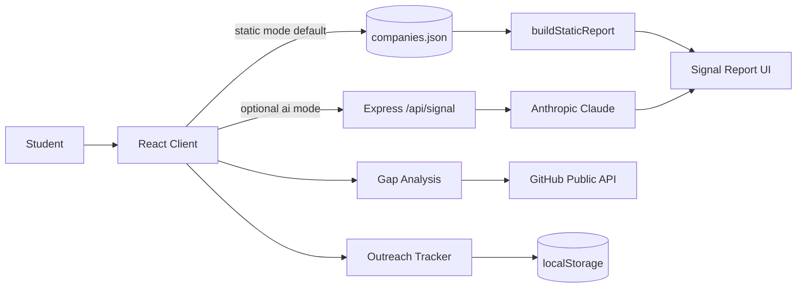

# Career Signal

Career Signal is a role intelligence engine for CS students who know where they want to work but do not know what to build to get there.

**Live demo:** https://career-signal.vercel.app *(deploy with `vercel login` then `vercel --prod` from repo root; set `VITE_LIVE_DEMO_URL` in Vercel env)*  
**Tech stack:** React, Vite, TailwindCSS, Node.js, Express, Anthropic (optional AI mode)  
**GitHub topics:** `react`, `vite`, `career`, `recruiting`, `portfolio`, `cs-students`, `job-search`

## Problem

Most student portfolios look the same: tutorial clones with weak hiring signal. Recruiters do not reject students because they are untalented; they reject because projects do not map clearly to what teams hire for.

Career Signal solves that by turning a target company + role into a practical build plan: what projects to ship, which JD keywords to mirror, which dataset to use, and how to frame the work in interviews.

## How It Works

1. User selects a company and role.
2. App generates a Signal Report with project recommendations and signal bands.
3. User shares report link (`?company=<id>&role=<id>`) or copies summary.


## Architecture



## Data Methodology

Company-role signals are **manually curated** from explainable sources:

- Public job descriptions (company careers pages, intern/new-grad SWE roles)
- Engineering blogs and technical career pages
- Interview pattern writeups and role competency expectations

Each newly added role includes a `source_notes` field documenting grounding (no job-board scraping, no LLM-hallucinated JD text).

Signals are categorized honestly as **Strong / Developing / Gap** — never fake percentage match scores.

## Current Features

- **Static report mode (default):** no backend or API key required
- **25 companies** with intern-level (and select full-time/domain) roles
- Optional AI mode through `/api/signal`
- Persistent app header with tab navigation (`?tab=signal|gap|outreach`)
- Filterable company combobox and “Try an example” quick start
- Searchable company selector
- Gap Analysis tab (GitHub + resume + target JD overlap)
- Outreach Tracker tab with localStorage persistence and follow-up dashboard
- Shareable deep links with Open Graph + dynamic page title
- Report exports: summary, share link, LinkedIn post, markdown share card
- Mobile-friendly report UI
- CI: build + Vitest on every push to `main`

## Run Locally

One command:

```bash
npm run setup && npm run dev:client
```

Open `http://localhost:5173`.

See [docs/DEPLOY.md](docs/DEPLOY.md) for full setup, env vars, and Vercel deploy steps.

### Optional AI mode

```bash
cp .env.example server/.env
# set ANTHROPIC_API_KEY
# client/.env.local -> VITE_REPORT_MODE=ai
npm run dev:server
npm run dev:client
```

## Deploy (Zero-Cost Path)

Vercel (recommended):

1. Import repo on Vercel
2. Build: `npm --prefix client run build`
3. Output: `client/dist`
4. Env: `VITE_REPORT_MODE=static`
5. Optional: `VITE_LIVE_DEMO_URL=https://<your-domain>`

`vercel.json` includes SPA rewrites for share links.

```bash
vercel login
vercel --prod --yes
```

## Testing and CI

```bash
npm run test:client
npm run build:client
```

- Static report schema validated for multiple company/role pairs
- Gap analyzer and outreach storage unit tests included
- GitHub Actions: `.github/workflows/ci.yml`

## What I Learned

1. **Structured output reliability:** AI responses need strict schemas and defensive parsing to stay production-safe.
2. **Latency-driven UX design:** static curated mode delivers instant value and eliminates API cost for public demos.
3. **Honest signal design:** categorical signal bands are more trustworthy than fabricated precision scores.

## Roadmap

- [x] 15+ companies with curated intern roles
- [x] Phase 2 gap analysis + outreach CRM
- [x] Share exports and deep links
- [x] CI + schema tests for static reports
- [ ] PNG share-card export for social posts
